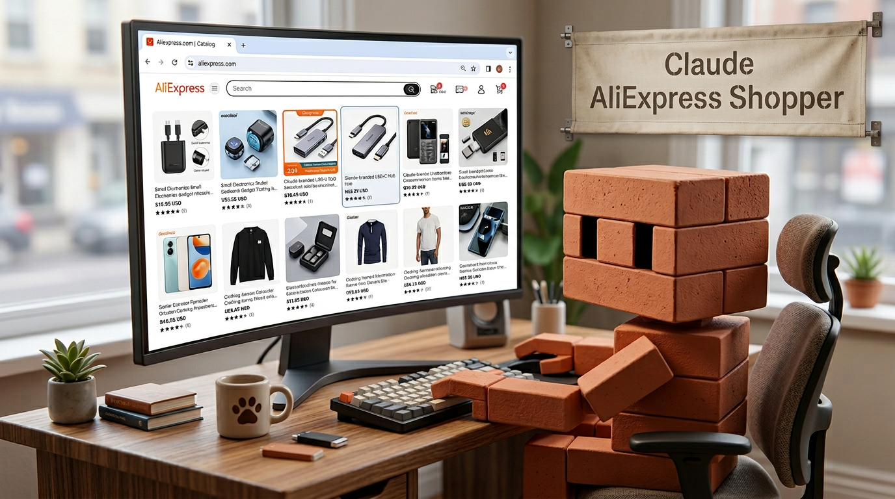

# Aliexpress-Shopper



A Claude Code plugin for shopping aliexpress.com **interactively in your own browser**, via [Claude in Chrome](https://www.anthropic.com/news/claude-for-chrome). Bundles two userscripts and a set of skills/commands that drive the live page in your Chrome session — search, read the listing you're on, compare open tabs, apply filters, find similar items, hide combo bundles.

## Scope

This plugin is deliberately **browser-driven and interactive**, not headless or programmatic.

- ✅ You're shopping in Chrome with Claude in Chrome enabled.
- ✅ You want Claude to read what's on the page, click filters, open tabs, summarise listings.
- ✅ Your locale, currency, login state, and recommendations stay yours — Claude works inside your session.
- ❌ Not for headless scraping, programmatic price comparison, or automated bulk extraction.
- ❌ Not Israel-specific. For Israeli buyer context (ILS, Hebrew search, IL reviews, landed-cost with VAT, Zap), use the separate [`Claude-Israel-Shopping-Plugin`](https://github.com/danielrosehill/Claude-Israel-Shopping-Plugin).

## Install

```bash
# Add as a Claude Code plugin
/plugin install danielrosehill/Aliexpress-Shopper
```

Then install the bundled userscripts:

```
/aliexpress-install-userscripts
```

(Or install them manually — see [`userscripts/README.md`](./userscripts/README.md).)

## Commands

| Command | What it does |
|---|---|
| `/aliexpress-search <query>` | Search aliexpress.com in your browser; read back the visible cards. |
| `/aliexpress-read` | Summarise the AliExpress listing in your active tab. |
| `/aliexpress-compare` | Compare every open `/item/` tab side-by-side. |
| `/aliexpress-filter <filters...>` | Toggle Choice / free shipping / 4★+ / ship-from / price range on the current results page. |
| `/aliexpress-similar [url]` | Find similar listings to the active tab (or a pasted URL). |
| `/aliexpress-combos [toggle\|hide\|show]` | Check on or flip the Hide Combo Deals userscript on the active tab. |
| `/aliexpress-install-userscripts` | Walk through Tampermonkey install for the bundled scripts and verify. |

## Skills

| Skill | Trigger |
|---|---|
| `search-aliexpress` | "search aliexpress for X", "find X on aliexpress" |
| `read-current-listing` | "what's on this page", "summarise this listing" |
| `compare-open-tabs` | "compare these tabs", "which of these is better" |
| `apply-filters` | "filter by free shipping", "only choice", "ship from china" |
| `find-similar` | "find similar to this", "alternatives to this" |
| `hide-combo-deals` | "hide combos", "show combos again", "how many combos hidden", "is the combo blocker working" |
| `install-userscripts` | "install the userscripts", "is find similar working" |

## Bundled userscripts

| Script | Effect |
|---|---|
| `aliexpress-find-similar.user.js` | 🔍 Similar button on every product card on search/category pages. |
| `aliexpress-no-combo.user.js` | Hides combo / bundle / Max Combo listings; floating counter + show/hide toggle. |

Upstream homes: [Aliexpress-Find-Similar-Userscript](https://github.com/danielrosehill/Aliexpress-Find-Similar-Userscript) · [AliExpress-No-Combo-Deals](https://github.com/danielrosehill/AliExpress-No-Combo-Deals).

## How it works

Every skill in this plugin operates through the `claude-in-chrome` MCP tools — `tabs_context_mcp`, `navigate`, `read_page`, `find`, `click`. Nothing in this plugin scrapes AliExpress over plain HTTP, signs API requests, or runs a headless browser. If Claude in Chrome isn't connected, the skills won't function.

## Related

- [`Claude-Israel-Shopping-Plugin`](https://github.com/danielrosehill/Claude-Israel-Shopping-Plugin) — IL-context shopping (ILS, Hebrew, IL reviews, landed-cost, Zap) with a programmatic Playwright path.
- [`AliExpress-Israel-Skill`](https://github.com/danielrosehill/AliExpress-Israel-Skill) — earlier IL-only single-skill predecessor.

## License

MIT.
